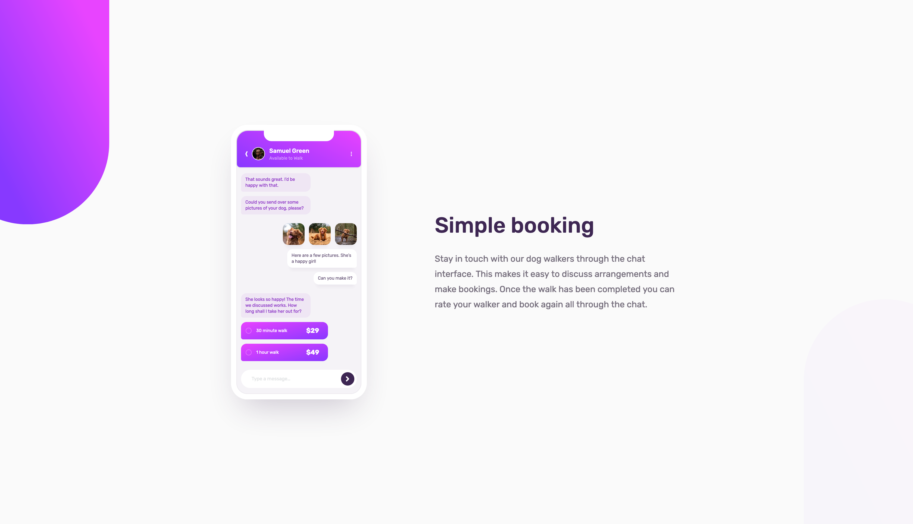
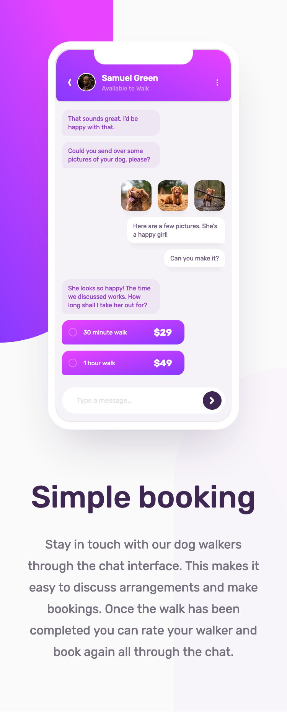

# Frontend Mentor - Chat app CSS illustration solution

This is a solution to the [Chat app CSS illustration challenge on Frontend Mentor](https://www.frontendmentor.io/challenges/chat-app-css-illustration-O5auMkFqY). Frontend Mentor challenges help you improve coding skills by building realistic projects.

## Table of contents

- [The challenge](#the-challenge)
- [Screenshots](#screenshots)
  - [1. Desktop version](#1-desktop-version)
  - [2. Mobile version](#2-mobile-version)
- [PageSpeed Insights results](#pagespeed-insights-results)
- [Links](#links)
- [My process](#my-process)
  - [Built with](#built-with)
  - [Tested with](#tested-with)
  - [What I learned](#what-i-learned)
  - [Continued development / improvements](#continued-development--improvements)
  - [Useful resources](#useful-resources)
- [Author](#author)

## Overview

### The challenge

Users should be able to:

- View the optimal layout for the component depending on their device's screen size
- **Bonus**: See the chat interface animate on the initial load

### Screenshots

##### 1. Desktop version



##### 2. Mobile version



### PageSpeed Insights results

[Mobile version](https://pagespeed.web.dev/analysis/https-rupali317-github-io-chat-app-css-illustration-only-html-css/kkqbd8fd2k?form_factor=mobile)

[Desktop version](https://pagespeed.web.dev/analysis/https-rupali317-github-io-chat-app-css-illustration-only-html-css/kkqbd8fd2k?form_factor=desktop)

### Links

- Solution URL: [Chat app CSS illustration github](https://github.com/rupali317/chat-app-css-illustration-only-html-css)
- Live Site URL: [Chat app CSS illustration live](https://rupali317.github.io/chat-app-css-illustration-only-html-css/)

## My process

### Built with

- Semantic HTML5 markup
- CSS custom properties
- Flexbox
- CSS grid
- CSS animation
- Mobile-first workflow
- SVGs
- [Github Pages](https://pages.github.com/) - Allows to host static websites directly from a GitHub repository

### Tested with

- Browsers used for testing: Google Chrome, Firefox, Safari, Brave, Microsoft Edge.
- Devices:
  - (Real) MacBook Pro (15-inch), Samsung Galaxy A33 5G, Samsung Galaxy S20+, iPad Air 2, MacBook Pro (13-inch).
  - (Virtual) The mobile and tablet devices mentioned under Chrome's dev console.
- Screen reader: MacOS VoiceOver.

### What I learned

- I took this opportunity to create all the icons on my own. I have understood the purpose of different SVG tags used while creating the icons.

- I implemented the animation of loading, where I utilised CSS animation and mask composite to achieve the loading animation.

```css
.loader {
  width: 8rem;
  aspect-ratio: 1;
  border-radius: var(--border-radius-rounded);
  --conic-gradient: conic-gradient(
    var(--color-primary-8) 0deg,
    var(--color-primary-6) 180deg,
    var(--color-primary-10) 350deg
  );
  --linear-gradient: linear-gradient(
    var(--color-neutral-8),
    var(--color-neutral-8)
  );
  background: var(--conic-gradient);
  padding: var(--space-l-2);
  --mask: var(--linear-gradient), var(--linear-gradient) content-box;
  -webkit-mask: var(--mask);
  mask: var(--mask);
  -webkit-mask-composite: source-out;
  mask-composite: subtract;
  animation: rotate-animation 0.8s infinite;
}

@keyframes rotate-animation {
  to {
    transform: rotate(1turn);
  }
}
```

- Instead of `--mask: var(--linear-gradient), var(--linear-gradient) content-box;`, I cannot write it as a solid color because gradients are treated differently than solid colors in masking. When using gradients, the entire gradient is treated as a mask. This means the mask will affect the alpha (transparency) values of the element. When using a solid color like #000 directly, it might not provide the same effect because solid colors might not always be interpreted as a mask with varying alpha values.

### Continued development / improvements

If I were to create a line diagram for left arrow and right arrow, I will use stroke-linejoin=”round”

### Useful resources

- [CSS tricks - mask composite](https://css-tricks.com/almanac/properties/m/mask-composite/) - This site helped me to grasp the concept of mask composite, which was key in creating the loading impression.
- [SVG path editor](https://yqnn.github.io/svg-path-editor/) - This site helped me to test the appearance of my SVGs.

## Author

- Website - [Rupali Roy Choudhury](https://www.linkedin.com/in/rupali-rc/)
- Frontend Mentor - [@rupali317](https://www.frontendmentor.io/profile/rupali317)
